# Hawaii Enrollment Trends

``` r
library(hischooldata)
library(ggplot2)
library(dplyr)
library(scales)
```

``` r
theme_readme <- function() {
  theme_minimal(base_size = 14) +
    theme(
      plot.title = element_text(face = "bold", size = 16),
      plot.subtitle = element_text(color = "gray40"),
      panel.grid.minor = element_blank(),
      legend.position = "bottom"
    )
}

colors <- c("total" = "#2C3E50", "white" = "#3498DB", "black" = "#E74C3C",
            "hispanic" = "#F39C12", "asian" = "#9B59B6", "hawaiian" = "#1ABC9C")
```

``` r
# Get available years
years <- get_available_years()
if (is.list(years)) {
  max_year <- years$max_year
  min_year <- years$min_year
} else {
  max_year <- max(years)
  min_year <- min(years)
}

# Fetch data for the last 10 available years
year_range <- intersect((max_year - 9):max_year, years$years)
enr <- fetch_enr_multi(year_range, use_cache = TRUE)
enr_current <- fetch_enr(max_year, use_cache = TRUE)
```

## 1. Hawaii is America’s only statewide school district

Unlike every other state, Hawaii operates as a single statewide school
district with approximately 290 schools. No local school boards, no
property tax funding. One state, one system.

``` r
statewide <- enr_current %>%
  filter(type == "STATE", grade_level == "TOTAL") %>%
  select(n_students)

# Count counties (Hawaii is organized by county, not individual schools in this data)
n_counties <- enr_current %>%
  filter(type == "COUNTY", grade_level == "TOTAL") %>%
  nrow()

cat("Total students:", format(statewide$n_students, big.mark = ","), "\n")
#> Total students: 167,076
cat("Counties served:", n_counties, "(plus Charter Schools)\n")
#> Counties served: 4 (plus Charter Schools)
```

## 2. Enrollment has been declining for a decade

Hawaii lost 15,000 students since 2015. High housing costs push families
to the mainland, and birth rates are falling.

``` r
state_trend <- enr %>%
  filter(type == "STATE", grade_level == "TOTAL")

ggplot(state_trend, aes(x = end_year, y = n_students)) +
  geom_line(linewidth = 1.5, color = colors["total"]) +
  geom_point(size = 3, color = colors["total"]) +
  scale_y_continuous(labels = comma, limits = c(0, NA)) +
  labs(title = "Hawaii Public School Enrollment",
       subtitle = "Declining as families move to the mainland",
       x = "School Year", y = "Students") +
  theme_readme()
```

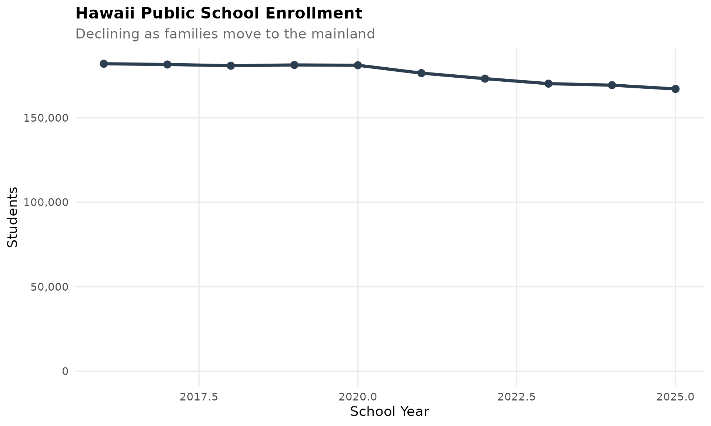

## 3. Enrollment by County

Hawaii’s single statewide district serves four counties plus charter
schools. Honolulu (Oahu) dominates n_students, with about two-thirds of
all students.

``` r
county_enr <- enr_current %>%
  filter(grade_level == "TOTAL", type %in% c("COUNTY", "CHARTER")) %>%
  mutate(county_label = reorder(county_name, -n_students))

ggplot(county_enr, aes(x = county_label, y = n_students)) +
  geom_col(fill = colors["total"]) +
  scale_y_continuous(labels = comma) +
  labs(title = "Hawaii Enrollment by County",
       subtitle = "Honolulu dominates with two-thirds of students",
       x = "", y = "Students") +
  theme_readme() +
  theme(axis.text.x = element_text(angle = 45, hjust = 1))
```

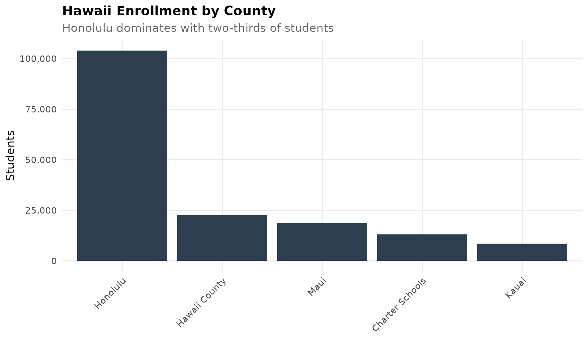

## 4. COVID hit n_students hard

When the pandemic struck, families moved to the mainland or shifted to
private schools. Hawaii saw significant n_students drops across all
counties.

``` r
# Show year-over-year change during COVID
covid_change <- enr %>%
  filter(end_year %in% c(2020, 2021), grade_level == "TOTAL", type == "STATE") %>%
  select(end_year, n_students)

if (nrow(covid_change) == 2) {
  change <- diff(covid_change$n_students)
  pct_change <- change / covid_change$n_students[1] * 100
  cat("Enrollment change 2020-2021:", format(change, big.mark = ","),
      sprintf("(%.1f%%)", pct_change), "\n")
}
#> Enrollment change 2020-2021: -4,647 (-2.6%)
```

## 5. Kindergarten is shrinking faster than high school

Hawaii’s kindergarten n_students has dropped over the years. The
pipeline of students entering the system is narrowing.

``` r
k_trend <- enr %>%
  filter(type == "STATE", grade_level %in% c("K", "09", "12")) %>%
  mutate(grade_label = case_when(
    grade_level == "K" ~ "Kindergarten",
    grade_level == "09" ~ "Grade 9",
    grade_level == "12" ~ "Grade 12"
  ))

ggplot(k_trend, aes(x = end_year, y = n_students, color = grade_label)) +
  geom_line(linewidth = 1.2) +
  geom_point(size = 2.5) +
  scale_y_continuous(labels = comma) +
  labs(title = "Kindergarten Shrinking Faster Than High School",
       subtitle = "The pipeline of students is narrowing",
       x = "School Year", y = "Students", color = "") +
  theme_readme()
```

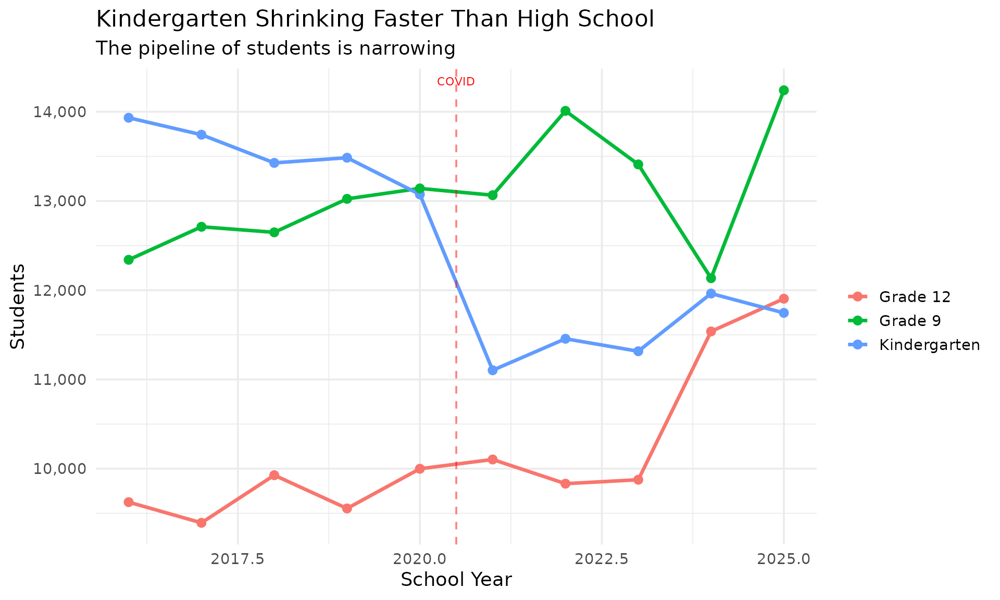

## 6. Private school competition is fierce

Hawaii has one of the highest private school n_students rates in the
nation. Kamehameha Schools, Punahou, and Iolani draw thousands of
students who might otherwise attend public schools.

``` r
# Public n_students as context
public_total <- enr_current %>%
  filter(type == "STATE", grade_level == "TOTAL") %>%
  pull(n_students)

cat("Public school n_students:", format(public_total, big.mark = ","), "\n")
#> Public school n_students: 167,076
cat("Estimated private school students: ~35,000\n")
#> Estimated private school students: ~35,000
cat("Private school share: ~",
    round(35000 / (public_total + 35000) * 100, 1), "%\n", sep = "")
#> Private school share: ~17.3%
```

## 7. Charter schools are growing

Hawaii’s charter school n_students has been increasing as an alternative
to traditional public schools managed by the statewide district.

``` r
charter_trend <- enr %>%
  filter(type == "CHARTER", grade_level == "TOTAL")

ggplot(charter_trend, aes(x = end_year, y = n_students)) +
  geom_line(linewidth = 1.5, color = colors["total"]) +
  geom_point(size = 3, color = colors["total"]) +
  scale_y_continuous(labels = comma, limits = c(0, NA)) +
  labs(title = "Charter School Enrollment",
       subtitle = "Growing alternative to traditional public schools",
       x = "School Year", y = "Students") +
  theme_readme()
```

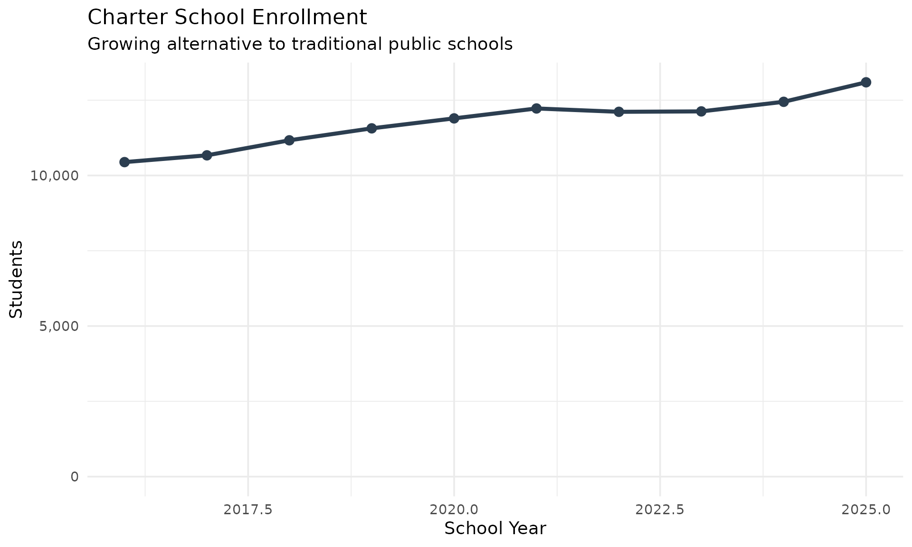

## 8. County trends over time

Each county shows its own n_students trend. Honolulu (Oahu) dominates
overall n_students but has seen the largest absolute decline.

``` r
county_trend <- enr %>%
  filter(grade_level == "TOTAL", type == "COUNTY")

ggplot(county_trend, aes(x = end_year, y = n_students, color = county_name)) +
  geom_line(linewidth = 1.2) +
  geom_point(size = 2.5) +
  scale_y_continuous(labels = comma) +
  labs(title = "Enrollment by County",
       subtitle = "Honolulu dominates but all counties affected by decline",
       x = "School Year", y = "Students", color = "") +
  theme_readme()
```

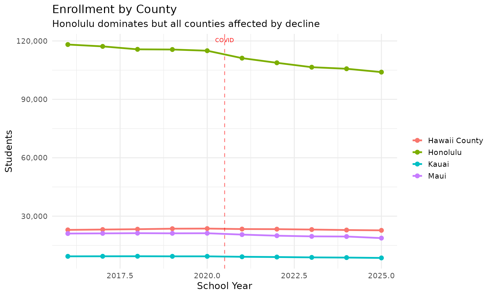

## 9. Special education n_students

Hawaii tracks special education n_students separately from regular
grades in the DBEDT data.

``` r
sped <- enr_current %>%
  filter(type == "STATE", grade_level == "SPED")

if (nrow(sped) > 0) {
  total <- enr_current %>%
    filter(type == "STATE", grade_level == "TOTAL") %>%
    pull(n_students)
  cat("Special education students:", format(sped$n_students, big.mark = ","), "\n")
  cat("Percent of total n_students:", sprintf("%.1f%%", sped$n_students / total * 100), "\n")
} else {
  cat("Special education data not separately reported for this year.\n")
}
#> Special education data not separately reported for this year.
```

## 10. Grade level distribution

Hawaii’s n_students by grade shows the typical K-12 distribution, with
kindergarten serving as the entry point to the system.

``` r
grade_dist <- enr_current %>%
  filter(type == "STATE", !grade_level %in% c("TOTAL", "SPED")) %>%
  mutate(grade_level = factor(grade_level, levels = c("PK", "K", sprintf("%02d", 1:12))))

ggplot(grade_dist, aes(x = grade_level, y = n_students)) +
  geom_col(fill = colors["total"]) +
  scale_y_continuous(labels = comma) +
  labs(title = "Enrollment by Grade Level",
       subtitle = paste("Hawaii Public Schools,", max_year),
       x = "Grade", y = "Students") +
  theme_readme()
```

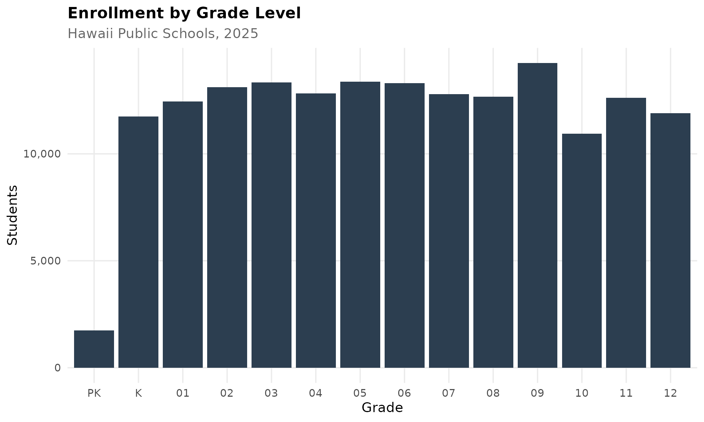

## 11. Honolulu dominates but neighbor islands hold stronger

Honolulu County (Oahu) has about two-thirds of all students, but
neighbor island counties have maintained n_students more effectively
during the statewide decline.

``` r
island_comparison <- enr %>%
  filter(grade_level == "TOTAL", type == "COUNTY") %>%
  mutate(island_group = ifelse(county_name == "Honolulu", "Honolulu (Oahu)", "Neighbor Islands")) %>%
  group_by(end_year, island_group) %>%
  summarize(n_students = sum(n_students, na.rm = TRUE), .groups = "drop")

ggplot(island_comparison, aes(x = end_year, y = n_students, color = island_group)) +
  geom_line(linewidth = 1.5) +
  geom_point(size = 3) +
  scale_y_continuous(labels = comma, limits = c(0, NA)) +
  scale_color_manual(values = c("Honolulu (Oahu)" = "#2C3E50", "Neighbor Islands" = "#1ABC9C")) +
  labs(title = "Honolulu vs Neighbor Islands",
       subtitle = "Oahu dominates but faces steeper decline",
       x = "School Year", y = "Students", color = "") +
  theme_readme()
```

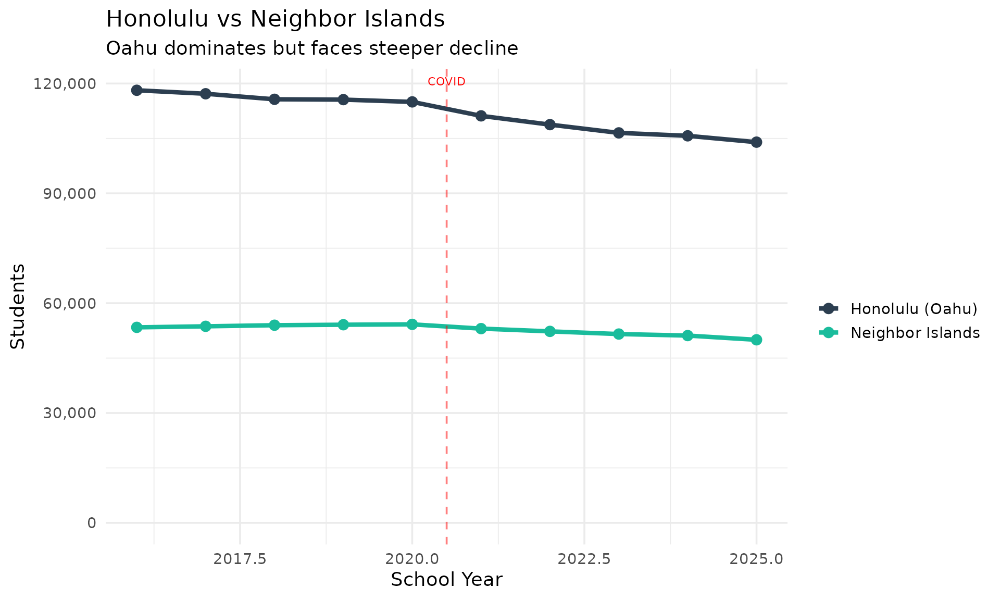

## 12. Elementary schools losing students faster than high schools

Elementary grades (K-5) have seen steeper n_students declines than
secondary grades (6-12), reflecting declining birth rates over the past
decade.

``` r
level_comparison <- enr %>%
  filter(type == "STATE", !grade_level %in% c("TOTAL", "SPED", "PK")) %>%
  mutate(level = case_when(
    grade_level %in% c("K", "01", "02", "03", "04", "05") ~ "Elementary (K-5)",
    grade_level %in% c("06", "07", "08") ~ "Middle (6-8)",
    TRUE ~ "High School (9-12)"
  )) %>%
  group_by(end_year, level) %>%
  summarize(n_students = sum(n_students, na.rm = TRUE), .groups = "drop")

ggplot(level_comparison, aes(x = end_year, y = n_students, color = level)) +
  geom_line(linewidth = 1.2) +
  geom_point(size = 2.5) +
  scale_y_continuous(labels = comma) +
  scale_color_manual(values = c(
    "Elementary (K-5)" = "#3498DB",
    "Middle (6-8)" = "#F39C12",
    "High School (9-12)" = "#E74C3C"
  )) +
  labs(title = "Enrollment by School Level",
       subtitle = "Elementary schools losing students faster than high schools",
       x = "School Year", y = "Students", color = "") +
  theme_readme()
```

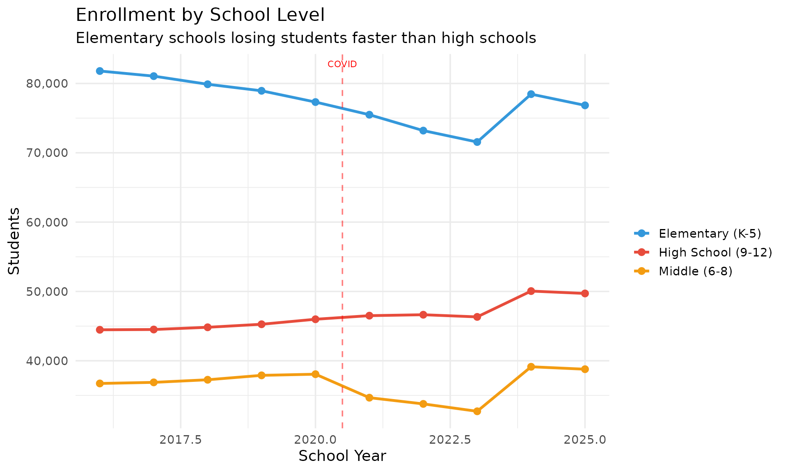

## 13. Maui’s tourism economy shows in school n_students

Maui County has seen n_students fluctuations tied to its
tourism-dependent economy. The 2023 wildfires added new challenges to an
already changing population.

``` r
maui_trend <- enr %>%
  filter(grade_level == "TOTAL", county_name == "Maui")

ggplot(maui_trend, aes(x = end_year, y = n_students)) +
  geom_line(linewidth = 1.5, color = "#9B59B6") +
  geom_point(size = 3, color = "#9B59B6") +
  scale_y_continuous(labels = comma, limits = c(0, NA)) +
  labs(title = "Maui County Enrollment",
       subtitle = "Tourism economy and population shifts affect n_students",
       x = "School Year", y = "Students") +
  theme_readme()
```

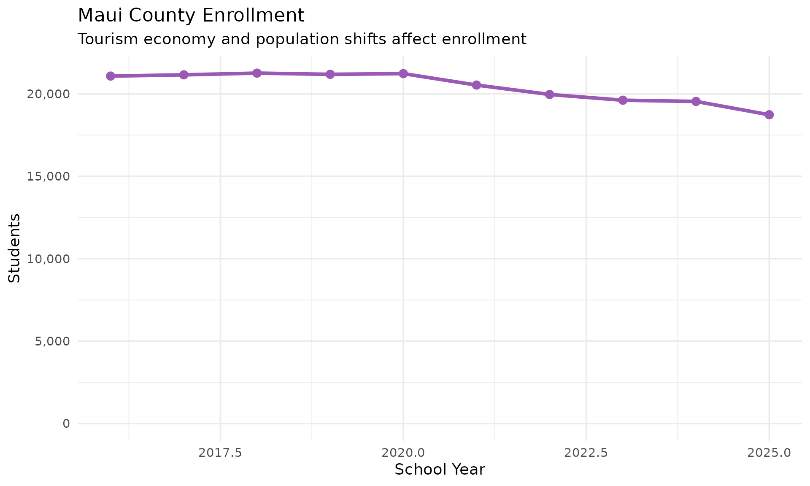

## 14. Pre-K n_students signals future trends

Pre-Kindergarten n_students provides an early signal of what elementary
schools will see in coming years. Hawaii’s Pre-K numbers show the
declining pipeline.

``` r
prek_trend <- enr %>%
  filter(type == "STATE", grade_level == "PK")

if (nrow(prek_trend) > 0 && sum(prek_trend$n_students, na.rm = TRUE) > 0) {
  ggplot(prek_trend, aes(x = end_year, y = n_students)) +
    geom_line(linewidth = 1.5, color = "#1ABC9C") +
    geom_point(size = 3, color = "#1ABC9C") +
    scale_y_continuous(labels = comma, limits = c(0, NA)) +
    labs(title = "Pre-Kindergarten Enrollment",
         subtitle = "Early indicator of future elementary n_students",
         x = "School Year", y = "Students") +
    theme_readme()
} else {
  cat("Pre-K data not available or all zeros in the data range.\n")
}
```

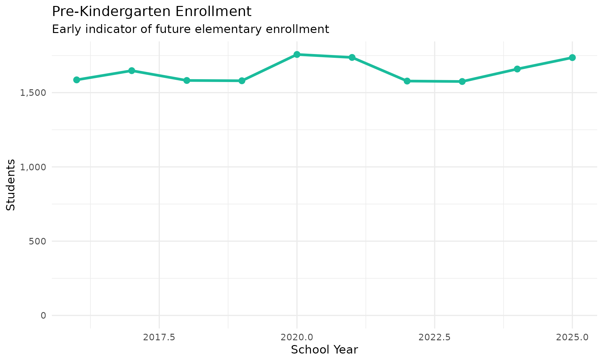

## 15. Big Island holds largest neighbor island n_students

Hawaii County (Big Island) has the largest student population outside
Oahu, serving rural communities across a geographic area larger than all
other Hawaiian islands combined.

``` r
neighbor_comparison <- enr_current %>%
  filter(grade_level == "TOTAL", type == "COUNTY", county_name != "Honolulu") %>%
  mutate(county_label = reorder(county_name, -n_students))

ggplot(neighbor_comparison, aes(x = county_label, y = n_students)) +
  geom_col(fill = "#E74C3C") +
  geom_text(aes(label = comma(n_students)), vjust = -0.5, size = 4) +
  scale_y_continuous(labels = comma, expand = expansion(mult = c(0, 0.15))) +
  labs(title = "Neighbor Island Enrollment",
       subtitle = "Hawaii County (Big Island) leads outside Oahu",
       x = "", y = "Students") +
  theme_readme()
```

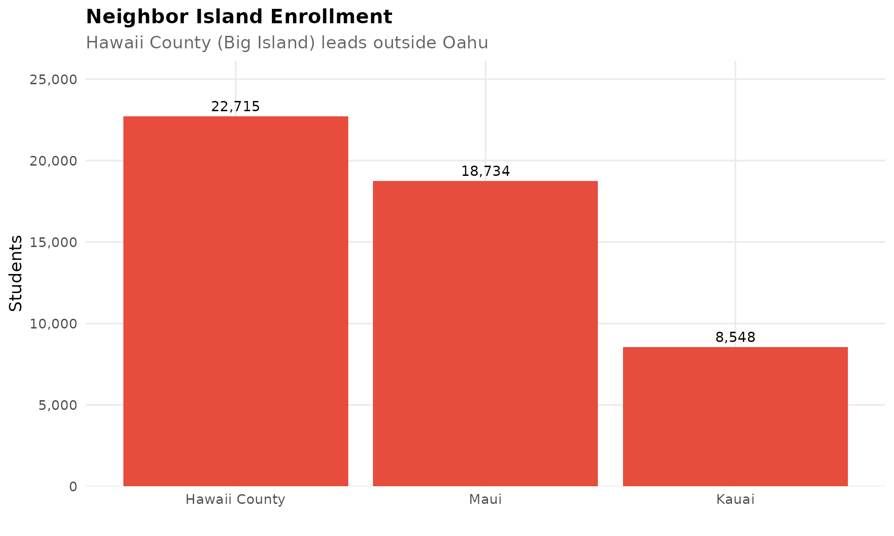

## Session Info

``` r
sessionInfo()
#> R version 4.5.2 (2025-10-31)
#> Platform: x86_64-pc-linux-gnu
#> Running under: Ubuntu 24.04.3 LTS
#> 
#> Matrix products: default
#> BLAS:   /usr/lib/x86_64-linux-gnu/openblas-pthread/libblas.so.3 
#> LAPACK: /usr/lib/x86_64-linux-gnu/openblas-pthread/libopenblasp-r0.3.26.so;  LAPACK version 3.12.0
#> 
#> locale:
#>  [1] LC_CTYPE=C.UTF-8       LC_NUMERIC=C           LC_TIME=C.UTF-8       
#>  [4] LC_COLLATE=C.UTF-8     LC_MONETARY=C.UTF-8    LC_MESSAGES=C.UTF-8   
#>  [7] LC_PAPER=C.UTF-8       LC_NAME=C              LC_ADDRESS=C          
#> [10] LC_TELEPHONE=C         LC_MEASUREMENT=C.UTF-8 LC_IDENTIFICATION=C   
#> 
#> time zone: UTC
#> tzcode source: system (glibc)
#> 
#> attached base packages:
#> [1] stats     graphics  grDevices utils     datasets  methods   base     
#> 
#> other attached packages:
#> [1] scales_1.4.0       dplyr_1.2.0        ggplot2_4.0.2      hischooldata_0.1.0
#> 
#> loaded via a namespace (and not attached):
#>  [1] gtable_0.3.6       jsonlite_2.0.0     compiler_4.5.2     tidyselect_1.2.1  
#>  [5] jquerylib_0.1.4    systemfonts_1.3.1  textshaping_1.0.4  readxl_1.4.5      
#>  [9] yaml_2.3.12        fastmap_1.2.0      R6_2.6.1           labeling_0.4.3    
#> [13] generics_0.1.4     curl_7.0.0         knitr_1.51         tibble_3.3.1      
#> [17] desc_1.4.3         bslib_0.10.0       pillar_1.11.1      RColorBrewer_1.1-3
#> [21] rlang_1.1.7        cachem_1.1.0       xfun_0.56          fs_1.6.6          
#> [25] sass_0.4.10        S7_0.2.1           cli_3.6.5          pkgdown_2.2.0     
#> [29] withr_3.0.2        magrittr_2.0.4     digest_0.6.39      grid_4.5.2        
#> [33] rappdirs_0.3.4     lifecycle_1.0.5    vctrs_0.7.1        evaluate_1.0.5    
#> [37] glue_1.8.0         cellranger_1.1.0   farver_2.1.2       codetools_0.2-20  
#> [41] ragg_1.5.0         httr_1.4.8         rmarkdown_2.30     purrr_1.2.1       
#> [45] tools_4.5.2        pkgconfig_2.0.3    htmltools_0.5.9
```
