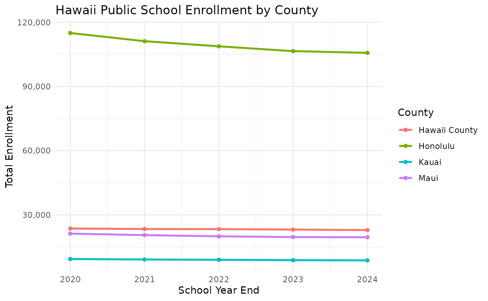
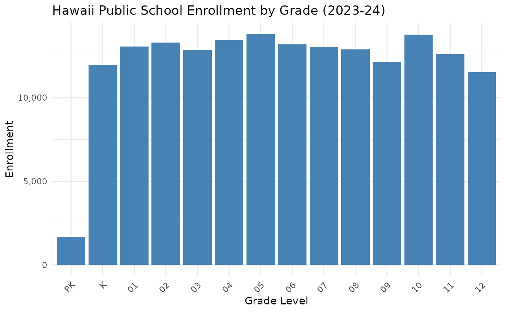

# Introduction to hischooldata

## Overview

The `hischooldata` package provides a simple interface for accessing
Hawaii public school enrollment data from the Hawaii Department of
Education (HIDOE) and the Hawaii State Department of Business, Economic
Development & Tourism (DBEDT) State Data Book.

## Hawaii’s Unique School Structure

Unlike all other U.S. states, **Hawaii has a single statewide school
district**. The Hawaii Department of Education operates all public
schools across the entire state, organized into four counties:

- **Honolulu** (Oahu) - approximately 62% of total enrollment
- **Hawaii County** (Big Island) - approximately 13% of enrollment
- **Maui** (includes Molokai and Lanai) - approximately 11% of
  enrollment
- **Kauai** - approximately 5% of enrollment
- **Charter Schools** - approximately 8% of enrollment (statewide)

This single-district structure means the data is naturally organized at
the county level rather than the school district level found in other
states.

## Installation

``` r
# Install from GitHub
# install.packages("devtools")
devtools::install_github("almartin82/hischooldata")
```

## Basic Usage

### Fetching Enrollment Data

The main function is
[`fetch_enr()`](https://almartin82.github.io/hischooldata/reference/fetch_enr.md),
which downloads enrollment data for a specific school year:

``` r
library(hischooldata)

# Get 2024 enrollment data (2023-24 school year)
enr_2024 <- fetch_enr(2024, use_cache = TRUE)
head(enr_2024)
#>   end_year district_id                  district_name county_name  type
#> 1     2024          HI Hawaii Department of Education State Total STATE
#> 2     2024          HI Hawaii Department of Education State Total STATE
#> 3     2024          HI Hawaii Department of Education State Total STATE
#> 4     2024          HI Hawaii Department of Education State Total STATE
#> 5     2024          HI Hawaii Department of Education State Total STATE
#> 6     2024          HI Hawaii Department of Education State Total STATE
#>   grade_level         subgroup n_students pct aggregation_flag is_state
#> 1       TOTAL total_enrollment     169308  NA            state     TRUE
#> 2          PK total_enrollment       1659  NA            state     TRUE
#> 3           K total_enrollment      11963  NA            state     TRUE
#> 4          01 total_enrollment      13060  NA            state     TRUE
#> 5          02 total_enrollment      13300  NA            state     TRUE
#> 6          03 total_enrollment      12869  NA            state     TRUE
#>   is_county is_charter
#> 1     FALSE      FALSE
#> 2     FALSE      FALSE
#> 3     FALSE      FALSE
#> 4     FALSE      FALSE
#> 5     FALSE      FALSE
#> 6     FALSE      FALSE
```

### Understanding the end_year Parameter

The `end_year` parameter represents the **END** of the school year:

- `end_year = 2024` means the 2023-24 school year (ending June 2024)
- `end_year = 2025` means the 2024-25 school year (ending June 2025)

This convention is consistent with other state schooldata packages.

### Available Years

Use
[`get_available_years()`](https://almartin82.github.io/hischooldata/reference/get_available_years.md)
to see what years are available:

``` r
get_available_years()
#> $min_year
#> [1] 2011
#> 
#> $max_year
#> [1] 2025
#> 
#> $years
#>  [1] 2011 2013 2014 2015 2016 2017 2018 2019 2020 2021 2022 2023 2024 2025
#> 
#> $description
#> [1] "Hawaii enrollment data is available for school years ending 2011 to 2025 (except 2012 - no 2011 Data Book published)"
```

**Note**: School year 2011-12 (end_year = 2012) is not available because
the 2011 DBEDT State Data Book was not published.

### Data Structure

The returned data frame includes:

| Column        | Description                                  |
|---------------|----------------------------------------------|
| `end_year`    | School year end (e.g., 2024 for 2023-24)     |
| `type`        | Aggregation level: STATE, COUNTY, or CHARTER |
| `county_name` | Geographic area name                         |
| `grade_level` | Grade level (PK, K, 01-12, SPED, or TOTAL)   |
| `n_students`  | Number of students enrolled                  |
| `is_state`    | Boolean flag for state-level data            |
| `is_county`   | Boolean flag for county-level data           |
| `is_charter`  | Boolean flag for charter school data         |

### Example: County-Level Analysis

``` r
library(dplyr)
library(ggplot2)

# Get recent years
enr_multi <- fetch_enr_multi(2020:2024, use_cache = TRUE)

# Calculate county totals over time
county_trends <- enr_multi |>
  filter(type == "COUNTY", grade_level == "TOTAL") |>
  select(end_year, county_name, n_students)

# Plot trends
ggplot(county_trends, aes(x = end_year, y = n_students, color = county_name)) +
  geom_line(linewidth = 1) +
  geom_point() +
  labs(
    title = "Hawaii Public School Enrollment by County",
    x = "School Year End",
    y = "Total Enrollment",
    color = "County"
  ) +
  scale_y_continuous(labels = scales::comma) +
  theme_minimal()
```



### Example: Grade-Level Analysis

``` r
# Get state-level enrollment by grade
enr_2024 <- fetch_enr(2024, use_cache = TRUE)
state_grades <- enr_2024 |>
  filter(type == "STATE", !grade_level %in% c("TOTAL", "SPED")) |>
  mutate(grade_level = factor(grade_level, levels = c("PK", "K", sprintf("%02d", 1:12))))

# Plot grade distribution
ggplot(state_grades, aes(x = grade_level, y = n_students)) +
  geom_col(fill = "steelblue") +
  labs(
    title = "Hawaii Public School Enrollment by Grade (2023-24)",
    x = "Grade Level",
    y = "Enrollment"
  ) +
  scale_y_continuous(labels = scales::comma) +
  theme_minimal() +
  theme(axis.text.x = element_text(angle = 45, hjust = 1))
```



## Caching

The package caches downloaded data locally to avoid repeated downloads:

``` r
# Check cache status
cache_status()
#>    year       type size_mb age_days
#> 1  2016 enrollment       0        0
#> 2  2017 enrollment       0        0
#> 3  2018 enrollment       0        0
#> 4  2019 enrollment       0        0
#> 5  2020 enrollment       0        0
#> 6  2021 enrollment       0        0
#> 7  2022 enrollment       0        0
#> 8  2023 enrollment       0        0
#> 9  2024 enrollment       0        0
#> 10 2025 enrollment       0        0

# Clear cache for a specific year
clear_cache(2024)

# Clear all cached data
clear_cache()
```

## Data Sources

The package fetches data from:

1.  **DBEDT State Data Book** (primary source): Tables 3.12 and 3.13
    - URL: <https://files.hawaii.gov/dbedt/economic/databook/>
    - Contains county-level enrollment by grade
2.  **HIDOE Official Enrollment** (fallback for recent years):
    - URL: <https://www.hawaiipublicschools.org/>
    - Contains school-level detail (when available)

## Known Data Limitations

1.  **No 2011-12 Data**: The 2011 DBEDT Data Book was not published, so
    end_year = 2012 is not available.

2.  **SPED Data**: Special Education enrollment is shown separately in
    most years but is suppressed in the 2024-25 data (per the 2024 Data
    Book footnote).

3.  **Multi-Year Tables**: The 2021 Data Book contains both 2020-21 and
    2021-22 school year data. The package handles extraction of the
    correct year.

4.  **COVID Impact**: Both the 2019 and 2020 Data Books contain 2019-20
    school year data (the 2020 Data Book is a duplicate due to COVID
    disruptions).

## Python Interface

A Python package is also available for accessing the same data:

``` python
# pip install hischooldata

from hischooldata import fetch_enr

df = fetch_enr(2024, use_cache=True)
print(df.head())
```

See the `pyhischooldata/` directory for the Python implementation.

## Session Info

``` r
sessionInfo()
#> R version 4.5.2 (2025-10-31)
#> Platform: x86_64-pc-linux-gnu
#> Running under: Ubuntu 24.04.3 LTS
#> 
#> Matrix products: default
#> BLAS:   /usr/lib/x86_64-linux-gnu/openblas-pthread/libblas.so.3 
#> LAPACK: /usr/lib/x86_64-linux-gnu/openblas-pthread/libopenblasp-r0.3.26.so;  LAPACK version 3.12.0
#> 
#> locale:
#>  [1] LC_CTYPE=C.UTF-8       LC_NUMERIC=C           LC_TIME=C.UTF-8       
#>  [4] LC_COLLATE=C.UTF-8     LC_MONETARY=C.UTF-8    LC_MESSAGES=C.UTF-8   
#>  [7] LC_PAPER=C.UTF-8       LC_NAME=C              LC_ADDRESS=C          
#> [10] LC_TELEPHONE=C         LC_MEASUREMENT=C.UTF-8 LC_IDENTIFICATION=C   
#> 
#> time zone: UTC
#> tzcode source: system (glibc)
#> 
#> attached base packages:
#> [1] stats     graphics  grDevices utils     datasets  methods   base     
#> 
#> other attached packages:
#> [1] ggplot2_4.0.1      dplyr_1.1.4        hischooldata_0.1.0
#> 
#> loaded via a namespace (and not attached):
#>  [1] gtable_0.3.6       jsonlite_2.0.0     compiler_4.5.2     tidyselect_1.2.1  
#>  [5] jquerylib_0.1.4    systemfonts_1.3.1  scales_1.4.0       textshaping_1.0.4 
#>  [9] yaml_2.3.12        fastmap_1.2.0      R6_2.6.1           labeling_0.4.3    
#> [13] generics_0.1.4     knitr_1.51         tibble_3.3.1       desc_1.4.3        
#> [17] bslib_0.9.0        pillar_1.11.1      RColorBrewer_1.1-3 rlang_1.1.7       
#> [21] cachem_1.1.0       xfun_0.55          fs_1.6.6           sass_0.4.10       
#> [25] S7_0.2.1           cli_3.6.5          pkgdown_2.2.0      withr_3.0.2       
#> [29] magrittr_2.0.4     digest_0.6.39      grid_4.5.2         rappdirs_0.3.4    
#> [33] lifecycle_1.0.5    vctrs_0.7.0        evaluate_1.0.5     glue_1.8.0        
#> [37] farver_2.1.2       codetools_0.2-20   ragg_1.5.0         purrr_1.2.1       
#> [41] rmarkdown_2.30     tools_4.5.2        pkgconfig_2.0.3    htmltools_0.5.9
```
