# Hawaii Enrollment Trends

``` r
library(hischooldata)
library(ggplot2)
library(dplyr)
library(scales)
```

``` r
# Get available years
years <- get_available_years()
if (is.list(years)) {
  max_year <- years$max_year
  min_year <- years$min_year
} else {
  max_year <- max(years)
  min_year <- min(years)
}

# Fetch data for the last 10 available years
year_range <- intersect((max_year - 9):max_year, years$years)
enr <- fetch_enr_multi(year_range, use_cache = TRUE)
enr_current <- fetch_enr(max_year, use_cache = TRUE)
```

## 1. Hawaii is America’s only statewide school district

Unlike every other state, Hawaii operates as a single statewide school
district with approximately 290 schools. No local school boards, no
property tax funding. One state, one system.

``` r
statewide <- enr_current %>%
  filter(type == "STATE", grade_level == "TOTAL") %>%
  select(n_students)
stopifnot(nrow(statewide) > 0)

# Count counties (Hawaii is organized by county, not individual schools in this data)
n_counties <- enr_current %>%
  filter(type == "COUNTY", grade_level == "TOTAL") %>%
  nrow()

cat("Total students:", format(statewide$n_students, big.mark = ","), "\n")
#> Total students: 167,076
cat("Counties served:", n_counties, "(plus Charter Schools)\n")
#> Counties served: 4 (plus Charter Schools)
```

## 2. Enrollment dropped ~15,000 students since 2016

Hawaii lost nearly 15,000 students since 2016. High housing costs push
families to the mainland, and birth rates are falling.

``` r
state_trend <- enr %>%
  filter(type == "STATE", grade_level == "TOTAL")

stopifnot(nrow(state_trend) > 0)
print(state_trend)
#>    end_year district_id                  district_name county_name  type
#> 1      2016          HI Hawaii Department of Education State Total STATE
#> 2      2017          HI Hawaii Department of Education State Total STATE
#> 3      2018          HI Hawaii Department of Education State Total STATE
#> 4      2019          HI Hawaii Department of Education State Total STATE
#> 5      2020          HI Hawaii Department of Education State Total STATE
#> 6      2021          HI Hawaii Department of Education State Total STATE
#> 7      2022          HI Hawaii Department of Education State Total STATE
#> 8      2023          HI Hawaii Department of Education State Total STATE
#> 9      2024          HI Hawaii Department of Education State Total STATE
#> 10     2025          HI Hawaii Department of Education State Total STATE
#>    grade_level         subgroup n_students pct aggregation_flag is_state
#> 1        TOTAL total_enrollment     181995  NA            state     TRUE
#> 2        TOTAL total_enrollment     181550  NA            state     TRUE
#> 3        TOTAL total_enrollment     180837  NA            state     TRUE
#> 4        TOTAL total_enrollment     181278  NA            state     TRUE
#> 5        TOTAL total_enrollment     181088  NA            state     TRUE
#> 6        TOTAL total_enrollment     176441  NA            state     TRUE
#> 7        TOTAL total_enrollment     173178  NA            state     TRUE
#> 8        TOTAL total_enrollment     170209  NA            state     TRUE
#> 9        TOTAL total_enrollment     169308  NA            state     TRUE
#> 10       TOTAL total_enrollment     167076  NA            state     TRUE
#>    is_county is_charter
#> 1      FALSE      FALSE
#> 2      FALSE      FALSE
#> 3      FALSE      FALSE
#> 4      FALSE      FALSE
#> 5      FALSE      FALSE
#> 6      FALSE      FALSE
#> 7      FALSE      FALSE
#> 8      FALSE      FALSE
#> 9      FALSE      FALSE
#> 10     FALSE      FALSE

ggplot(state_trend, aes(x = end_year, y = n_students)) +
  geom_line(linewidth = 1.5, color = "#2C3E50") +
  geom_point(size = 3, color = "#2C3E50") +
  geom_vline(xintercept = 2020.5, linetype = "dashed", color = "red", alpha = 0.5) +
  annotate("text", x = 2020.5, y = Inf, label = "COVID", vjust = 2, color = "red", size = 3) +
  scale_y_continuous(labels = comma, limits = c(0, NA)) +
  labs(title = "Hawaii Public School Enrollment",
       subtitle = "Declining as families move to the mainland",
       x = "School Year", y = "Students") +
  theme_minimal(base_size = 14)
```

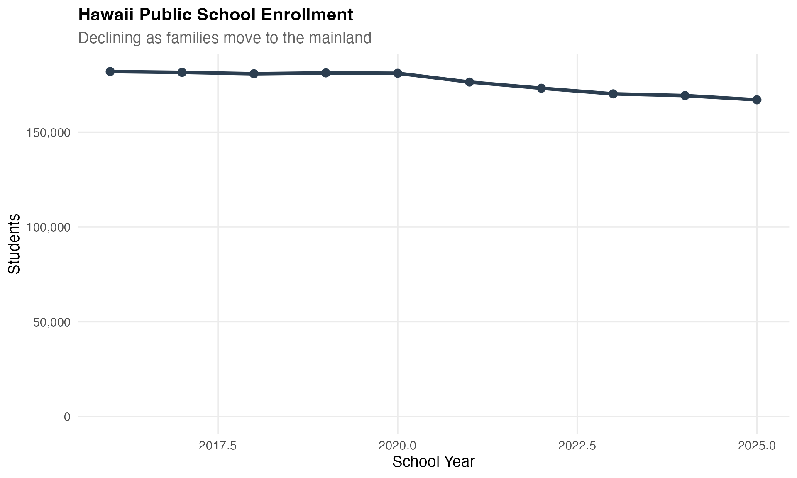

## 3. Enrollment by County

Hawaii’s single statewide district serves four counties plus charter
schools. Honolulu (Oahu) dominates enrollment, with about two-thirds of
all students.

``` r
county_enr <- enr_current %>%
  filter(grade_level == "TOTAL", type %in% c("COUNTY", "CHARTER")) %>%
  mutate(county_label = reorder(county_name, -n_students))

stopifnot(nrow(county_enr) > 0)
print(county_enr)
#>   end_year district_id                  district_name     county_name    type
#> 1     2025          HI Hawaii Department of Education        Honolulu  COUNTY
#> 2     2025          HI Hawaii Department of Education   Hawaii County  COUNTY
#> 3     2025          HI Hawaii Department of Education            Maui  COUNTY
#> 4     2025          HI Hawaii Department of Education           Kauai  COUNTY
#> 5     2025          HI Hawaii Department of Education Charter Schools CHARTER
#>   grade_level         subgroup n_students pct aggregation_flag is_state
#> 1       TOTAL total_enrollment     103985  NA         district    FALSE
#> 2       TOTAL total_enrollment      22715  NA         district    FALSE
#> 3       TOTAL total_enrollment      18734  NA         district    FALSE
#> 4       TOTAL total_enrollment       8548  NA         district    FALSE
#> 5       TOTAL total_enrollment      13094  NA         district    FALSE
#>   is_county is_charter    county_label
#> 1      TRUE      FALSE        Honolulu
#> 2      TRUE      FALSE   Hawaii County
#> 3      TRUE      FALSE            Maui
#> 4      TRUE      FALSE           Kauai
#> 5     FALSE       TRUE Charter Schools

ggplot(county_enr, aes(x = county_label, y = n_students)) +
  geom_col(fill = "#2C3E50") +
  scale_y_continuous(labels = comma) +
  labs(title = "Hawaii Enrollment by County",
       subtitle = "Honolulu dominates with two-thirds of students",
       x = "", y = "Students") +
  theme_minimal(base_size = 14) +
  theme(axis.text.x = element_text(angle = 45, hjust = 1))
```

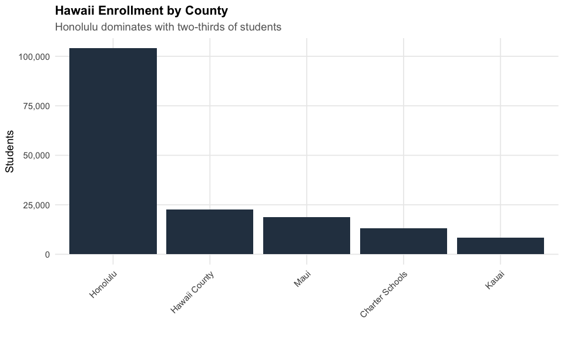

## 4. COVID hit enrollment hard – 4,647 students lost in one year

When the pandemic struck, families moved to the mainland or shifted to
private schools. Hawaii lost 4,647 students (2.6%) between 2020 and
2021.

``` r
# Show year-over-year change during COVID
covid_change <- enr %>%
  filter(end_year %in% c(2020, 2021), grade_level == "TOTAL", type == "STATE") %>%
  select(end_year, n_students)
stopifnot(nrow(covid_change) == 2)

change <- diff(covid_change$n_students)
pct_change <- change / covid_change$n_students[1] * 100
cat("Enrollment change 2020-2021:", format(change, big.mark = ","),
    sprintf("(%.1f%%)", pct_change), "\n")
#> Enrollment change 2020-2021: -4,647 (-2.6%)
```

## 5. Kindergarten is shrinking faster than high school

Hawaii’s kindergarten enrollment dropped from ~13,900 to ~11,700 while
Grade 9 grew. The pipeline of students entering the system is narrowing.

``` r
k_trend <- enr %>%
  filter(type == "STATE", grade_level %in% c("K", "09", "12")) %>%
  mutate(grade_label = case_when(
    grade_level == "K" ~ "Kindergarten",
    grade_level == "09" ~ "Grade 9",
    grade_level == "12" ~ "Grade 12"
  ))

stopifnot(nrow(k_trend) > 0)
print(k_trend)
#>    end_year district_id                  district_name county_name  type
#> 1      2016          HI Hawaii Department of Education State Total STATE
#> 2      2016          HI Hawaii Department of Education State Total STATE
#> 3      2016          HI Hawaii Department of Education State Total STATE
#> 4      2017          HI Hawaii Department of Education State Total STATE
#> 5      2017          HI Hawaii Department of Education State Total STATE
#> 6      2017          HI Hawaii Department of Education State Total STATE
#> 7      2018          HI Hawaii Department of Education State Total STATE
#> 8      2018          HI Hawaii Department of Education State Total STATE
#> 9      2018          HI Hawaii Department of Education State Total STATE
#> 10     2019          HI Hawaii Department of Education State Total STATE
#> 11     2019          HI Hawaii Department of Education State Total STATE
#> 12     2019          HI Hawaii Department of Education State Total STATE
#> 13     2020          HI Hawaii Department of Education State Total STATE
#> 14     2020          HI Hawaii Department of Education State Total STATE
#> 15     2020          HI Hawaii Department of Education State Total STATE
#> 16     2021          HI Hawaii Department of Education State Total STATE
#> 17     2021          HI Hawaii Department of Education State Total STATE
#> 18     2021          HI Hawaii Department of Education State Total STATE
#> 19     2022          HI Hawaii Department of Education State Total STATE
#> 20     2022          HI Hawaii Department of Education State Total STATE
#> 21     2022          HI Hawaii Department of Education State Total STATE
#> 22     2023          HI Hawaii Department of Education State Total STATE
#> 23     2023          HI Hawaii Department of Education State Total STATE
#> 24     2023          HI Hawaii Department of Education State Total STATE
#> 25     2024          HI Hawaii Department of Education State Total STATE
#> 26     2024          HI Hawaii Department of Education State Total STATE
#> 27     2024          HI Hawaii Department of Education State Total STATE
#> 28     2025          HI Hawaii Department of Education State Total STATE
#> 29     2025          HI Hawaii Department of Education State Total STATE
#> 30     2025          HI Hawaii Department of Education State Total STATE
#>    grade_level         subgroup n_students pct aggregation_flag is_state
#> 1            K total_enrollment      13933  NA            state     TRUE
#> 2           09 total_enrollment      12341  NA            state     TRUE
#> 3           12 total_enrollment       9625  NA            state     TRUE
#> 4            K total_enrollment      13743  NA            state     TRUE
#> 5           09 total_enrollment      12711  NA            state     TRUE
#> 6           12 total_enrollment       9393  NA            state     TRUE
#> 7            K total_enrollment      13427  NA            state     TRUE
#> 8           09 total_enrollment      12649  NA            state     TRUE
#> 9           12 total_enrollment       9927  NA            state     TRUE
#> 10           K total_enrollment      13485  NA            state     TRUE
#> 11          09 total_enrollment      13024  NA            state     TRUE
#> 12          12 total_enrollment       9554  NA            state     TRUE
#> 13           K total_enrollment      13074  NA            state     TRUE
#> 14          09 total_enrollment      13141  NA            state     TRUE
#> 15          12 total_enrollment       9999  NA            state     TRUE
#> 16           K total_enrollment      11103  NA            state     TRUE
#> 17          09 total_enrollment      13065  NA            state     TRUE
#> 18          12 total_enrollment      10103  NA            state     TRUE
#> 19           K total_enrollment      11456  NA            state     TRUE
#> 20          09 total_enrollment      14010  NA            state     TRUE
#> 21          12 total_enrollment       9832  NA            state     TRUE
#> 22           K total_enrollment      11316  NA            state     TRUE
#> 23          09 total_enrollment      13410  NA            state     TRUE
#> 24          12 total_enrollment       9876  NA            state     TRUE
#> 25           K total_enrollment      11963  NA            state     TRUE
#> 26          09 total_enrollment      12135  NA            state     TRUE
#> 27          12 total_enrollment      11538  NA            state     TRUE
#> 28           K total_enrollment      11746  NA            state     TRUE
#> 29          09 total_enrollment      14241  NA            state     TRUE
#> 30          12 total_enrollment      11905  NA            state     TRUE
#>    is_county is_charter  grade_label
#> 1      FALSE      FALSE Kindergarten
#> 2      FALSE      FALSE      Grade 9
#> 3      FALSE      FALSE     Grade 12
#> 4      FALSE      FALSE Kindergarten
#> 5      FALSE      FALSE      Grade 9
#> 6      FALSE      FALSE     Grade 12
#> 7      FALSE      FALSE Kindergarten
#> 8      FALSE      FALSE      Grade 9
#> 9      FALSE      FALSE     Grade 12
#> 10     FALSE      FALSE Kindergarten
#> 11     FALSE      FALSE      Grade 9
#> 12     FALSE      FALSE     Grade 12
#> 13     FALSE      FALSE Kindergarten
#> 14     FALSE      FALSE      Grade 9
#> 15     FALSE      FALSE     Grade 12
#> 16     FALSE      FALSE Kindergarten
#> 17     FALSE      FALSE      Grade 9
#> 18     FALSE      FALSE     Grade 12
#> 19     FALSE      FALSE Kindergarten
#> 20     FALSE      FALSE      Grade 9
#> 21     FALSE      FALSE     Grade 12
#> 22     FALSE      FALSE Kindergarten
#> 23     FALSE      FALSE      Grade 9
#> 24     FALSE      FALSE     Grade 12
#> 25     FALSE      FALSE Kindergarten
#> 26     FALSE      FALSE      Grade 9
#> 27     FALSE      FALSE     Grade 12
#> 28     FALSE      FALSE Kindergarten
#> 29     FALSE      FALSE      Grade 9
#> 30     FALSE      FALSE     Grade 12

ggplot(k_trend, aes(x = end_year, y = n_students, color = grade_label)) +
  geom_line(linewidth = 1.2) +
  geom_point(size = 2.5) +
  geom_vline(xintercept = 2020.5, linetype = "dashed", color = "red", alpha = 0.5) +
  annotate("text", x = 2020.5, y = Inf, label = "COVID", vjust = 2, color = "red", size = 3) +
  scale_y_continuous(labels = comma) +
  labs(title = "Kindergarten Shrinking Faster Than High School",
       subtitle = "The pipeline of students is narrowing",
       x = "School Year", y = "Students", color = "") +
  theme_minimal(base_size = 14)
```

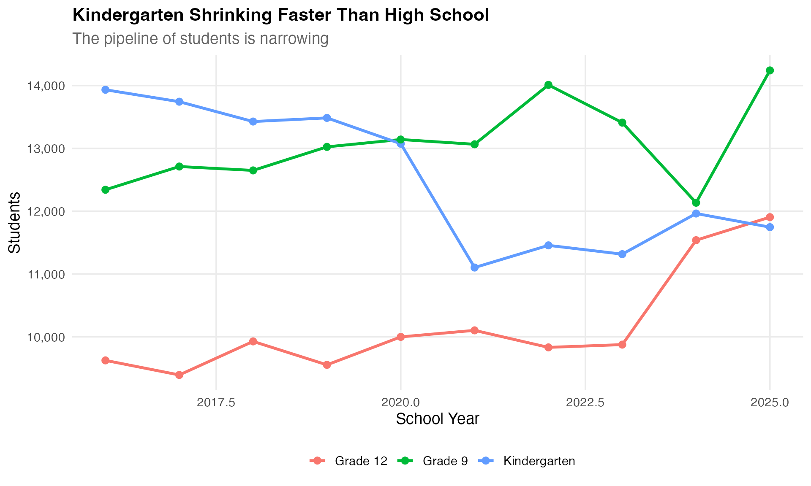

## 6. Private school competition is fierce

Hawaii has one of the highest private school enrollment rates in the
nation. Kamehameha Schools, Punahou, and Iolani draw thousands of
students who might otherwise attend public schools.

``` r
# Public enrollment as context
public_total <- enr_current %>%
  filter(type == "STATE", grade_level == "TOTAL") %>%
  pull(n_students)
stopifnot(length(public_total) == 1)

cat("Public school enrollment:", format(public_total, big.mark = ","), "\n")
#> Public school enrollment: 167,076
cat("Estimated private school students: ~35,000\n")
#> Estimated private school students: ~35,000
cat("Private school share: ~",
    round(35000 / (public_total + 35000) * 100, 1), "%\n", sep = "")
#> Private school share: ~17.3%
```

## 7. Charter schools grew 25% since 2016

Hawaii’s charter school enrollment grew from 10,444 to 13,094 students –
a 25% increase while overall enrollment declined.

``` r
charter_trend <- enr %>%
  filter(type == "CHARTER", grade_level == "TOTAL")

stopifnot(nrow(charter_trend) > 0)
print(charter_trend)
#>    end_year district_id                  district_name     county_name    type
#> 1      2016          HI Hawaii Department of Education Charter Schools CHARTER
#> 2      2017          HI Hawaii Department of Education Charter Schools CHARTER
#> 3      2018          HI Hawaii Department of Education Charter Schools CHARTER
#> 4      2019          HI Hawaii Department of Education Charter Schools CHARTER
#> 5      2020          HI Hawaii Department of Education Charter Schools CHARTER
#> 6      2021          HI Hawaii Department of Education Charter Schools CHARTER
#> 7      2022          HI Hawaii Department of Education Charter Schools CHARTER
#> 8      2023          HI Hawaii Department of Education Charter Schools CHARTER
#> 9      2024          HI Hawaii Department of Education Charter Schools CHARTER
#> 10     2025          HI Hawaii Department of Education Charter Schools CHARTER
#>    grade_level         subgroup n_students pct aggregation_flag is_state
#> 1        TOTAL total_enrollment      10444  NA         district    FALSE
#> 2        TOTAL total_enrollment      10669  NA         district    FALSE
#> 3        TOTAL total_enrollment      11168  NA         district    FALSE
#> 4        TOTAL total_enrollment      11565  NA         district    FALSE
#> 5        TOTAL total_enrollment      11896  NA         district    FALSE
#> 6        TOTAL total_enrollment      12225  NA         district    FALSE
#> 7        TOTAL total_enrollment      12114  NA         district    FALSE
#> 8        TOTAL total_enrollment      12128  NA         district    FALSE
#> 9        TOTAL total_enrollment      12446  NA         district    FALSE
#> 10       TOTAL total_enrollment      13094  NA         district    FALSE
#>    is_county is_charter
#> 1      FALSE       TRUE
#> 2      FALSE       TRUE
#> 3      FALSE       TRUE
#> 4      FALSE       TRUE
#> 5      FALSE       TRUE
#> 6      FALSE       TRUE
#> 7      FALSE       TRUE
#> 8      FALSE       TRUE
#> 9      FALSE       TRUE
#> 10     FALSE       TRUE

ggplot(charter_trend, aes(x = end_year, y = n_students)) +
  geom_line(linewidth = 1.5, color = "#2C3E50") +
  geom_point(size = 3, color = "#2C3E50") +
  geom_vline(xintercept = 2020.5, linetype = "dashed", color = "red", alpha = 0.5) +
  annotate("text", x = 2020.5, y = Inf, label = "COVID", vjust = 2, color = "red", size = 3) +
  scale_y_continuous(labels = comma, limits = c(0, NA)) +
  labs(title = "Charter School Enrollment",
       subtitle = "Growing alternative to traditional public schools",
       x = "School Year", y = "Students") +
  theme_minimal(base_size = 14)
```

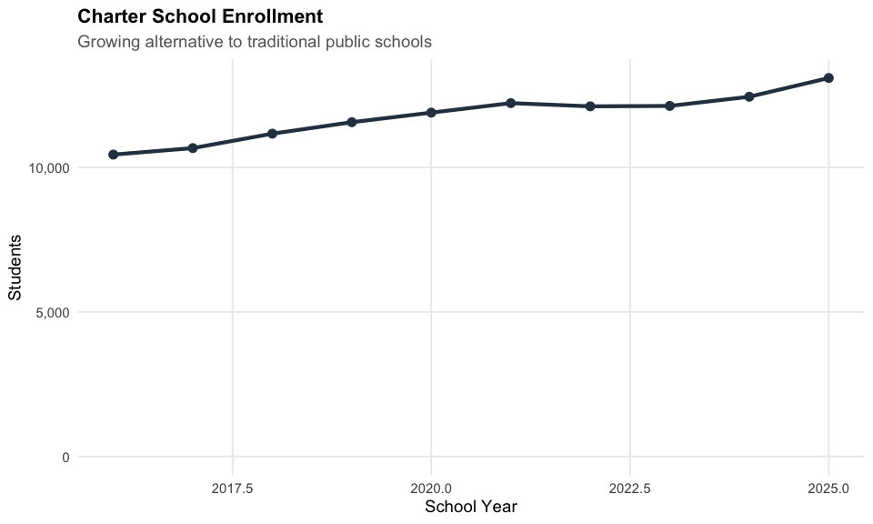

## 8. County trends over time

Each county shows its own enrollment trend. Honolulu (Oahu) dominates
overall enrollment but has seen the largest absolute decline.

``` r
county_trend <- enr %>%
  filter(grade_level == "TOTAL", type == "COUNTY")

stopifnot(nrow(county_trend) > 0)
print(county_trend)
#>    end_year district_id                  district_name   county_name   type
#> 1      2016          HI Hawaii Department of Education      Honolulu COUNTY
#> 2      2016          HI Hawaii Department of Education Hawaii County COUNTY
#> 3      2016          HI Hawaii Department of Education          Maui COUNTY
#> 4      2016          HI Hawaii Department of Education         Kauai COUNTY
#> 5      2017          HI Hawaii Department of Education      Honolulu COUNTY
#> 6      2017          HI Hawaii Department of Education Hawaii County COUNTY
#> 7      2017          HI Hawaii Department of Education          Maui COUNTY
#> 8      2017          HI Hawaii Department of Education         Kauai COUNTY
#> 9      2018          HI Hawaii Department of Education      Honolulu COUNTY
#> 10     2018          HI Hawaii Department of Education Hawaii County COUNTY
#> 11     2018          HI Hawaii Department of Education          Maui COUNTY
#> 12     2018          HI Hawaii Department of Education         Kauai COUNTY
#> 13     2019          HI Hawaii Department of Education      Honolulu COUNTY
#> 14     2019          HI Hawaii Department of Education Hawaii County COUNTY
#> 15     2019          HI Hawaii Department of Education          Maui COUNTY
#> 16     2019          HI Hawaii Department of Education         Kauai COUNTY
#> 17     2020          HI Hawaii Department of Education      Honolulu COUNTY
#> 18     2020          HI Hawaii Department of Education Hawaii County COUNTY
#> 19     2020          HI Hawaii Department of Education          Maui COUNTY
#> 20     2020          HI Hawaii Department of Education         Kauai COUNTY
#> 21     2021          HI Hawaii Department of Education      Honolulu COUNTY
#> 22     2021          HI Hawaii Department of Education Hawaii County COUNTY
#> 23     2021          HI Hawaii Department of Education          Maui COUNTY
#> 24     2021          HI Hawaii Department of Education         Kauai COUNTY
#> 25     2022          HI Hawaii Department of Education      Honolulu COUNTY
#> 26     2022          HI Hawaii Department of Education Hawaii County COUNTY
#> 27     2022          HI Hawaii Department of Education          Maui COUNTY
#> 28     2022          HI Hawaii Department of Education         Kauai COUNTY
#> 29     2023          HI Hawaii Department of Education      Honolulu COUNTY
#> 30     2023          HI Hawaii Department of Education Hawaii County COUNTY
#> 31     2023          HI Hawaii Department of Education          Maui COUNTY
#> 32     2023          HI Hawaii Department of Education         Kauai COUNTY
#> 33     2024          HI Hawaii Department of Education      Honolulu COUNTY
#> 34     2024          HI Hawaii Department of Education Hawaii County COUNTY
#> 35     2024          HI Hawaii Department of Education          Maui COUNTY
#> 36     2024          HI Hawaii Department of Education         Kauai COUNTY
#> 37     2025          HI Hawaii Department of Education      Honolulu COUNTY
#> 38     2025          HI Hawaii Department of Education Hawaii County COUNTY
#> 39     2025          HI Hawaii Department of Education          Maui COUNTY
#> 40     2025          HI Hawaii Department of Education         Kauai COUNTY
#>    grade_level         subgroup n_students pct aggregation_flag is_state
#> 1        TOTAL total_enrollment     118155  NA         district    FALSE
#> 2        TOTAL total_enrollment      22949  NA         district    FALSE
#> 3        TOTAL total_enrollment      21080  NA         district    FALSE
#> 4        TOTAL total_enrollment       9367  NA         district    FALSE
#> 5        TOTAL total_enrollment     117203  NA         district    FALSE
#> 6        TOTAL total_enrollment      23131  NA         district    FALSE
#> 7        TOTAL total_enrollment      21155  NA         district    FALSE
#> 8        TOTAL total_enrollment       9392  NA         district    FALSE
#> 9        TOTAL total_enrollment     115691  NA         district    FALSE
#> 10       TOTAL total_enrollment      23308  NA         district    FALSE
#> 11       TOTAL total_enrollment      21259  NA         district    FALSE
#> 12       TOTAL total_enrollment       9411  NA         district    FALSE
#> 13       TOTAL total_enrollment     115600  NA         district    FALSE
#> 14       TOTAL total_enrollment      23563  NA         district    FALSE
#> 15       TOTAL total_enrollment      21185  NA         district    FALSE
#> 16       TOTAL total_enrollment       9365  NA         district    FALSE
#> 17       TOTAL total_enrollment     114980  NA         district    FALSE
#> 18       TOTAL total_enrollment      23622  NA         district    FALSE
#> 19       TOTAL total_enrollment      21229  NA         district    FALSE
#> 20       TOTAL total_enrollment       9361  NA         district    FALSE
#> 21       TOTAL total_enrollment     111166  NA         district    FALSE
#> 22       TOTAL total_enrollment      23375  NA         district    FALSE
#> 23       TOTAL total_enrollment      20535  NA         district    FALSE
#> 24       TOTAL total_enrollment       9140  NA         district    FALSE
#> 25       TOTAL total_enrollment     108770  NA         district    FALSE
#> 26       TOTAL total_enrollment      23326  NA         district    FALSE
#> 27       TOTAL total_enrollment      19963  NA         district    FALSE
#> 28       TOTAL total_enrollment       9005  NA         district    FALSE
#> 29       TOTAL total_enrollment     106515  NA         district    FALSE
#> 30       TOTAL total_enrollment      23127  NA         district    FALSE
#> 31       TOTAL total_enrollment      19615  NA         district    FALSE
#> 32       TOTAL total_enrollment       8824  NA         district    FALSE
#> 33       TOTAL total_enrollment     105712  NA         district    FALSE
#> 34       TOTAL total_enrollment      22880  NA         district    FALSE
#> 35       TOTAL total_enrollment      19541  NA         district    FALSE
#> 36       TOTAL total_enrollment       8729  NA         district    FALSE
#> 37       TOTAL total_enrollment     103985  NA         district    FALSE
#> 38       TOTAL total_enrollment      22715  NA         district    FALSE
#> 39       TOTAL total_enrollment      18734  NA         district    FALSE
#> 40       TOTAL total_enrollment       8548  NA         district    FALSE
#>    is_county is_charter
#> 1       TRUE      FALSE
#> 2       TRUE      FALSE
#> 3       TRUE      FALSE
#> 4       TRUE      FALSE
#> 5       TRUE      FALSE
#> 6       TRUE      FALSE
#> 7       TRUE      FALSE
#> 8       TRUE      FALSE
#> 9       TRUE      FALSE
#> 10      TRUE      FALSE
#> 11      TRUE      FALSE
#> 12      TRUE      FALSE
#> 13      TRUE      FALSE
#> 14      TRUE      FALSE
#> 15      TRUE      FALSE
#> 16      TRUE      FALSE
#> 17      TRUE      FALSE
#> 18      TRUE      FALSE
#> 19      TRUE      FALSE
#> 20      TRUE      FALSE
#> 21      TRUE      FALSE
#> 22      TRUE      FALSE
#> 23      TRUE      FALSE
#> 24      TRUE      FALSE
#> 25      TRUE      FALSE
#> 26      TRUE      FALSE
#> 27      TRUE      FALSE
#> 28      TRUE      FALSE
#> 29      TRUE      FALSE
#> 30      TRUE      FALSE
#> 31      TRUE      FALSE
#> 32      TRUE      FALSE
#> 33      TRUE      FALSE
#> 34      TRUE      FALSE
#> 35      TRUE      FALSE
#> 36      TRUE      FALSE
#> 37      TRUE      FALSE
#> 38      TRUE      FALSE
#> 39      TRUE      FALSE
#> 40      TRUE      FALSE

ggplot(county_trend, aes(x = end_year, y = n_students, color = county_name)) +
  geom_line(linewidth = 1.2) +
  geom_point(size = 2.5) +
  geom_vline(xintercept = 2020.5, linetype = "dashed", color = "red", alpha = 0.5) +
  annotate("text", x = 2020.5, y = Inf, label = "COVID", vjust = 2, color = "red", size = 3) +
  scale_y_continuous(labels = comma) +
  labs(title = "Enrollment by County",
       subtitle = "Honolulu dominates but all counties affected by decline",
       x = "School Year", y = "Students", color = "") +
  theme_minimal(base_size = 14)
```

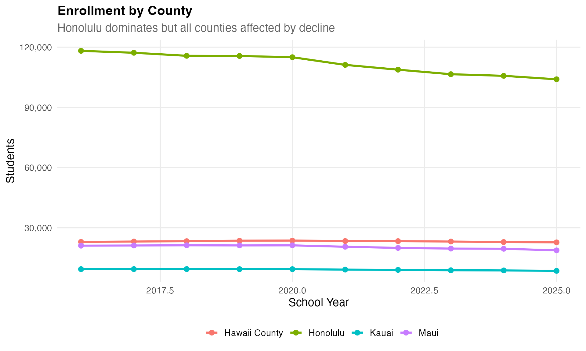

## 9. Special education enrollment

Hawaii tracks special education enrollment separately from regular
grades in the DBEDT data. SPED data is suppressed in the most recent
year per the Data Book footnote.

``` r
sped <- enr_current %>%
  filter(type == "STATE", grade_level == "SPED")

if (nrow(sped) > 0) {
  total <- enr_current %>%
    filter(type == "STATE", grade_level == "TOTAL") %>%
    pull(n_students)
  cat("Special education students:", format(sped$n_students, big.mark = ","), "\n")
  cat("Percent of total enrollment:", sprintf("%.1f%%", sped$n_students / total * 100), "\n")
} else {
  cat("Special education data not separately reported for this year.\n")
}
#> Special education data not separately reported for this year.
```

## 10. Grade level distribution

Hawaii’s enrollment by grade shows the typical K-12 distribution, with
Grade 9 as the largest grade in 2025.

``` r
grade_dist <- enr_current %>%
  filter(type == "STATE", !grade_level %in% c("TOTAL", "SPED")) %>%
  mutate(grade_level = factor(grade_level, levels = c("PK", "K", sprintf("%02d", 1:12))))

stopifnot(nrow(grade_dist) > 0)
print(grade_dist)
#>    end_year district_id                  district_name county_name  type
#> 1      2025          HI Hawaii Department of Education State Total STATE
#> 2      2025          HI Hawaii Department of Education State Total STATE
#> 3      2025          HI Hawaii Department of Education State Total STATE
#> 4      2025          HI Hawaii Department of Education State Total STATE
#> 5      2025          HI Hawaii Department of Education State Total STATE
#> 6      2025          HI Hawaii Department of Education State Total STATE
#> 7      2025          HI Hawaii Department of Education State Total STATE
#> 8      2025          HI Hawaii Department of Education State Total STATE
#> 9      2025          HI Hawaii Department of Education State Total STATE
#> 10     2025          HI Hawaii Department of Education State Total STATE
#> 11     2025          HI Hawaii Department of Education State Total STATE
#> 12     2025          HI Hawaii Department of Education State Total STATE
#> 13     2025          HI Hawaii Department of Education State Total STATE
#> 14     2025          HI Hawaii Department of Education State Total STATE
#>    grade_level         subgroup n_students pct aggregation_flag is_state
#> 1           PK total_enrollment       1736  NA            state     TRUE
#> 2            K total_enrollment      11746  NA            state     TRUE
#> 3           01 total_enrollment      12451  NA            state     TRUE
#> 4           02 total_enrollment      13115  NA            state     TRUE
#> 5           03 total_enrollment      13336  NA            state     TRUE
#> 6           04 total_enrollment      12822  NA            state     TRUE
#> 7           05 total_enrollment      13376  NA            state     TRUE
#> 8           06 total_enrollment      13312  NA            state     TRUE
#> 9           07 total_enrollment      12797  NA            state     TRUE
#> 10          08 total_enrollment      12675  NA            state     TRUE
#> 11          09 total_enrollment      14241  NA            state     TRUE
#> 12          10 total_enrollment      10938  NA            state     TRUE
#> 13          11 total_enrollment      12626  NA            state     TRUE
#> 14          12 total_enrollment      11905  NA            state     TRUE
#>    is_county is_charter
#> 1      FALSE      FALSE
#> 2      FALSE      FALSE
#> 3      FALSE      FALSE
#> 4      FALSE      FALSE
#> 5      FALSE      FALSE
#> 6      FALSE      FALSE
#> 7      FALSE      FALSE
#> 8      FALSE      FALSE
#> 9      FALSE      FALSE
#> 10     FALSE      FALSE
#> 11     FALSE      FALSE
#> 12     FALSE      FALSE
#> 13     FALSE      FALSE
#> 14     FALSE      FALSE

ggplot(grade_dist, aes(x = grade_level, y = n_students)) +
  geom_col(fill = "#2C3E50") +
  scale_y_continuous(labels = comma) +
  labs(title = "Enrollment by Grade Level",
       subtitle = paste("Hawaii Public Schools,", max_year),
       x = "Grade", y = "Students") +
  theme_minimal(base_size = 14)
```

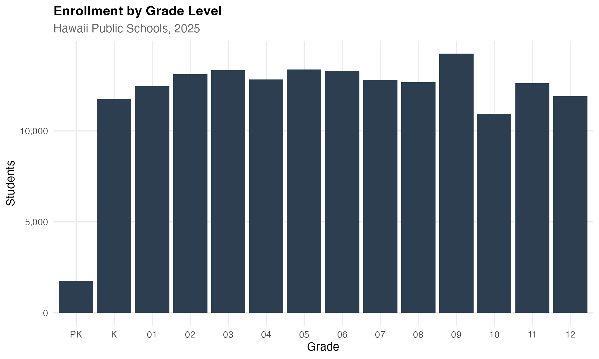

## 11. Honolulu lost 14,170 students while neighbor islands lost only 3,399

Honolulu County (Oahu) has about two-thirds of all students, but
neighbor island counties have maintained enrollment more effectively
during the statewide decline.

``` r
island_comparison <- enr %>%
  filter(grade_level == "TOTAL", type == "COUNTY") %>%
  mutate(island_group = ifelse(county_name == "Honolulu", "Honolulu (Oahu)", "Neighbor Islands")) %>%
  group_by(end_year, island_group) %>%
  summarize(n_students = sum(n_students, na.rm = TRUE), .groups = "drop")

stopifnot(nrow(island_comparison) > 0)
print(island_comparison)
#> # A tibble: 20 × 3
#>    end_year island_group     n_students
#>       <dbl> <chr>                 <dbl>
#>  1     2016 Honolulu (Oahu)      118155
#>  2     2016 Neighbor Islands      53396
#>  3     2017 Honolulu (Oahu)      117203
#>  4     2017 Neighbor Islands      53678
#>  5     2018 Honolulu (Oahu)      115691
#>  6     2018 Neighbor Islands      53978
#>  7     2019 Honolulu (Oahu)      115600
#>  8     2019 Neighbor Islands      54113
#>  9     2020 Honolulu (Oahu)      114980
#> 10     2020 Neighbor Islands      54212
#> 11     2021 Honolulu (Oahu)      111166
#> 12     2021 Neighbor Islands      53050
#> 13     2022 Honolulu (Oahu)      108770
#> 14     2022 Neighbor Islands      52294
#> 15     2023 Honolulu (Oahu)      106515
#> 16     2023 Neighbor Islands      51566
#> 17     2024 Honolulu (Oahu)      105712
#> 18     2024 Neighbor Islands      51150
#> 19     2025 Honolulu (Oahu)      103985
#> 20     2025 Neighbor Islands      49997

ggplot(island_comparison, aes(x = end_year, y = n_students, color = island_group)) +
  geom_line(linewidth = 1.5) +
  geom_point(size = 3) +
  geom_vline(xintercept = 2020.5, linetype = "dashed", color = "red", alpha = 0.5) +
  annotate("text", x = 2020.5, y = Inf, label = "COVID", vjust = 2, color = "red", size = 3) +
  scale_y_continuous(labels = comma, limits = c(0, NA)) +
  scale_color_manual(values = c("Honolulu (Oahu)" = "#2C3E50", "Neighbor Islands" = "#1ABC9C")) +
  labs(title = "Honolulu vs Neighbor Islands",
       subtitle = "Oahu dominates but faces steeper decline",
       x = "School Year", y = "Students", color = "") +
  theme_minimal(base_size = 14)
```

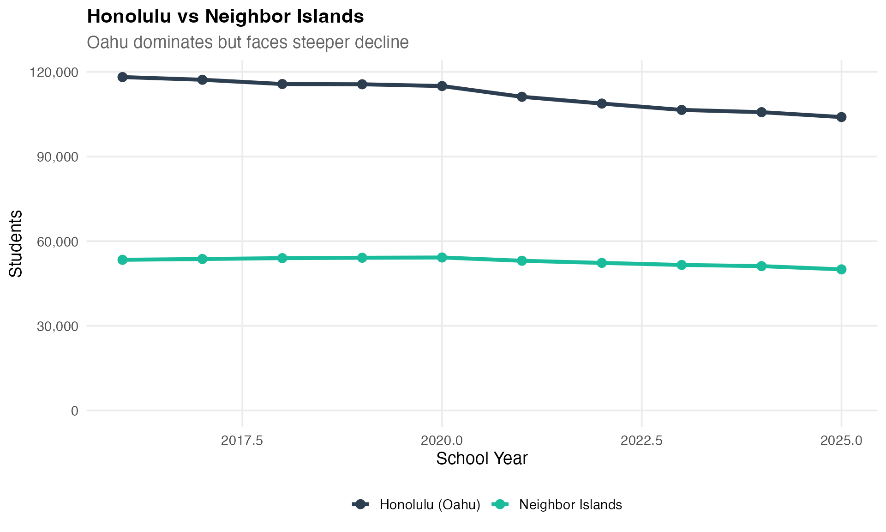

## 12. Elementary schools losing students faster than high schools

Elementary grades (K-5) have seen steeper enrollment declines than
secondary grades (6-12), reflecting declining birth rates over the past
decade.

``` r
level_comparison <- enr %>%
  filter(type == "STATE", !grade_level %in% c("TOTAL", "SPED", "PK")) %>%
  mutate(level = case_when(
    grade_level %in% c("K", "01", "02", "03", "04", "05") ~ "Elementary (K-5)",
    grade_level %in% c("06", "07", "08") ~ "Middle (6-8)",
    TRUE ~ "High School (9-12)"
  )) %>%
  group_by(end_year, level) %>%
  summarize(n_students = sum(n_students, na.rm = TRUE), .groups = "drop")

stopifnot(nrow(level_comparison) > 0)
print(level_comparison)
#> # A tibble: 30 × 3
#>    end_year level              n_students
#>       <dbl> <chr>                   <dbl>
#>  1     2016 Elementary (K-5)        81797
#>  2     2016 High School (9-12)      44468
#>  3     2016 Middle (6-8)            36729
#>  4     2017 Elementary (K-5)        81059
#>  5     2017 High School (9-12)      44509
#>  6     2017 Middle (6-8)            36885
#>  7     2018 Elementary (K-5)        79886
#>  8     2018 High School (9-12)      44830
#>  9     2018 Middle (6-8)            37260
#> 10     2019 Elementary (K-5)        78944
#> # ℹ 20 more rows

ggplot(level_comparison, aes(x = end_year, y = n_students, color = level)) +
  geom_line(linewidth = 1.2) +
  geom_point(size = 2.5) +
  geom_vline(xintercept = 2020.5, linetype = "dashed", color = "red", alpha = 0.5) +
  annotate("text", x = 2020.5, y = Inf, label = "COVID", vjust = 2, color = "red", size = 3) +
  scale_y_continuous(labels = comma) +
  scale_color_manual(values = c(
    "Elementary (K-5)" = "#3498DB",
    "Middle (6-8)" = "#F39C12",
    "High School (9-12)" = "#E74C3C"
  )) +
  labs(title = "Enrollment by School Level",
       subtitle = "Elementary schools losing students faster than high schools",
       x = "School Year", y = "Students", color = "") +
  theme_minimal(base_size = 14)
```

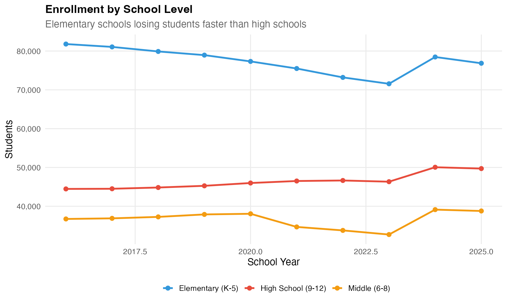

## 13. Maui lost 2,346 students since 2016 – wildfires compound the decline

Maui County has seen enrollment drop from 21,080 to 18,734 since 2016.
The 2023 Lahaina wildfire added new challenges to an already declining
population.

``` r
maui_trend <- enr %>%
  filter(grade_level == "TOTAL", county_name == "Maui")

stopifnot(nrow(maui_trend) > 0)
print(maui_trend)
#>    end_year district_id                  district_name county_name   type
#> 1      2016          HI Hawaii Department of Education        Maui COUNTY
#> 2      2017          HI Hawaii Department of Education        Maui COUNTY
#> 3      2018          HI Hawaii Department of Education        Maui COUNTY
#> 4      2019          HI Hawaii Department of Education        Maui COUNTY
#> 5      2020          HI Hawaii Department of Education        Maui COUNTY
#> 6      2021          HI Hawaii Department of Education        Maui COUNTY
#> 7      2022          HI Hawaii Department of Education        Maui COUNTY
#> 8      2023          HI Hawaii Department of Education        Maui COUNTY
#> 9      2024          HI Hawaii Department of Education        Maui COUNTY
#> 10     2025          HI Hawaii Department of Education        Maui COUNTY
#>    grade_level         subgroup n_students pct aggregation_flag is_state
#> 1        TOTAL total_enrollment      21080  NA         district    FALSE
#> 2        TOTAL total_enrollment      21155  NA         district    FALSE
#> 3        TOTAL total_enrollment      21259  NA         district    FALSE
#> 4        TOTAL total_enrollment      21185  NA         district    FALSE
#> 5        TOTAL total_enrollment      21229  NA         district    FALSE
#> 6        TOTAL total_enrollment      20535  NA         district    FALSE
#> 7        TOTAL total_enrollment      19963  NA         district    FALSE
#> 8        TOTAL total_enrollment      19615  NA         district    FALSE
#> 9        TOTAL total_enrollment      19541  NA         district    FALSE
#> 10       TOTAL total_enrollment      18734  NA         district    FALSE
#>    is_county is_charter
#> 1       TRUE      FALSE
#> 2       TRUE      FALSE
#> 3       TRUE      FALSE
#> 4       TRUE      FALSE
#> 5       TRUE      FALSE
#> 6       TRUE      FALSE
#> 7       TRUE      FALSE
#> 8       TRUE      FALSE
#> 9       TRUE      FALSE
#> 10      TRUE      FALSE

ggplot(maui_trend, aes(x = end_year, y = n_students)) +
  geom_line(linewidth = 1.5, color = "#9B59B6") +
  geom_point(size = 3, color = "#9B59B6") +
  geom_vline(xintercept = 2020.5, linetype = "dashed", color = "red", alpha = 0.5) +
  annotate("text", x = 2020.5, y = Inf, label = "COVID", vjust = 2, color = "red", size = 3) +
  scale_y_continuous(labels = comma, limits = c(0, NA)) +
  labs(title = "Maui County Enrollment",
       subtitle = "Tourism economy and wildfire impacts affect enrollment",
       x = "School Year", y = "Students") +
  theme_minimal(base_size = 14)
```

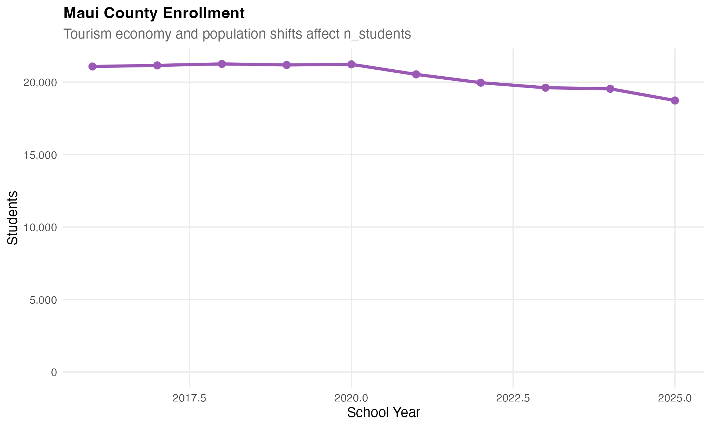

## 14. Pre-K enrollment holds steady around 1,600

Pre-Kindergarten enrollment has remained relatively stable around 1,600
students, fluctuating between 1,575 and 1,757 over the past decade.

``` r
prek_trend <- enr %>%
  filter(type == "STATE", grade_level == "PK")

stopifnot(nrow(prek_trend) > 0)
print(prek_trend)
#>    end_year district_id                  district_name county_name  type
#> 1      2016          HI Hawaii Department of Education State Total STATE
#> 2      2017          HI Hawaii Department of Education State Total STATE
#> 3      2018          HI Hawaii Department of Education State Total STATE
#> 4      2019          HI Hawaii Department of Education State Total STATE
#> 5      2020          HI Hawaii Department of Education State Total STATE
#> 6      2021          HI Hawaii Department of Education State Total STATE
#> 7      2022          HI Hawaii Department of Education State Total STATE
#> 8      2023          HI Hawaii Department of Education State Total STATE
#> 9      2024          HI Hawaii Department of Education State Total STATE
#> 10     2025          HI Hawaii Department of Education State Total STATE
#>    grade_level         subgroup n_students pct aggregation_flag is_state
#> 1           PK total_enrollment       1586  NA            state     TRUE
#> 2           PK total_enrollment       1648  NA            state     TRUE
#> 3           PK total_enrollment       1582  NA            state     TRUE
#> 4           PK total_enrollment       1580  NA            state     TRUE
#> 5           PK total_enrollment       1757  NA            state     TRUE
#> 6           PK total_enrollment       1737  NA            state     TRUE
#> 7           PK total_enrollment       1578  NA            state     TRUE
#> 8           PK total_enrollment       1575  NA            state     TRUE
#> 9           PK total_enrollment       1659  NA            state     TRUE
#> 10          PK total_enrollment       1736  NA            state     TRUE
#>    is_county is_charter
#> 1      FALSE      FALSE
#> 2      FALSE      FALSE
#> 3      FALSE      FALSE
#> 4      FALSE      FALSE
#> 5      FALSE      FALSE
#> 6      FALSE      FALSE
#> 7      FALSE      FALSE
#> 8      FALSE      FALSE
#> 9      FALSE      FALSE
#> 10     FALSE      FALSE

ggplot(prek_trend, aes(x = end_year, y = n_students)) +
  geom_line(linewidth = 1.5, color = "#1ABC9C") +
  geom_point(size = 3, color = "#1ABC9C") +
  geom_vline(xintercept = 2020.5, linetype = "dashed", color = "red", alpha = 0.5) +
  annotate("text", x = 2020.5, y = Inf, label = "COVID", vjust = 2, color = "red", size = 3) +
  scale_y_continuous(labels = comma, limits = c(0, NA)) +
  labs(title = "Pre-Kindergarten Enrollment",
       subtitle = "Stable around 1,600 students per year",
       x = "School Year", y = "Students") +
  theme_minimal(base_size = 14)
```

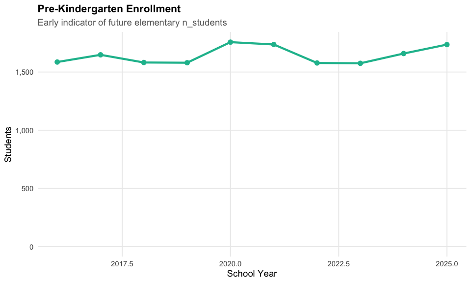

## 15. Big Island holds largest neighbor island enrollment

Hawaii County (Big Island) has the largest student population outside
Oahu with 22,715 students, serving rural communities across a geographic
area larger than all other Hawaiian islands combined.

``` r
neighbor_comparison <- enr_current %>%
  filter(grade_level == "TOTAL", type == "COUNTY", county_name != "Honolulu") %>%
  mutate(county_label = reorder(county_name, -n_students))

stopifnot(nrow(neighbor_comparison) > 0)
print(neighbor_comparison)
#>   end_year district_id                  district_name   county_name   type
#> 1     2025          HI Hawaii Department of Education Hawaii County COUNTY
#> 2     2025          HI Hawaii Department of Education          Maui COUNTY
#> 3     2025          HI Hawaii Department of Education         Kauai COUNTY
#>   grade_level         subgroup n_students pct aggregation_flag is_state
#> 1       TOTAL total_enrollment      22715  NA         district    FALSE
#> 2       TOTAL total_enrollment      18734  NA         district    FALSE
#> 3       TOTAL total_enrollment       8548  NA         district    FALSE
#>   is_county is_charter  county_label
#> 1      TRUE      FALSE Hawaii County
#> 2      TRUE      FALSE          Maui
#> 3      TRUE      FALSE         Kauai

ggplot(neighbor_comparison, aes(x = county_label, y = n_students)) +
  geom_col(fill = "#E74C3C") +
  geom_text(aes(label = comma(n_students)), vjust = -0.5, size = 4) +
  scale_y_continuous(labels = comma, expand = expansion(mult = c(0, 0.15))) +
  labs(title = "Neighbor Island Enrollment",
       subtitle = "Hawaii County (Big Island) leads outside Oahu",
       x = "", y = "Students") +
  theme_minimal(base_size = 14)
```

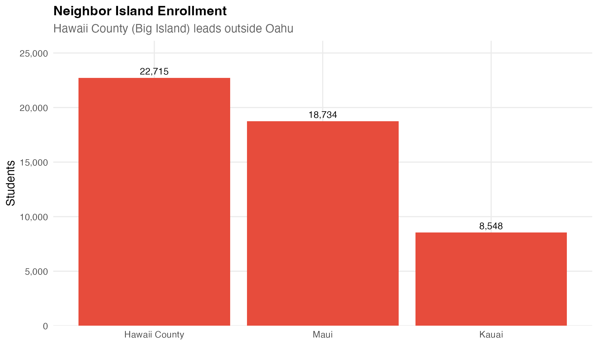

## Session Info

``` r
sessionInfo()
#> R version 4.5.0 (2025-04-11)
#> Platform: aarch64-apple-darwin22.6.0
#> Running under: macOS 26.1
#> 
#> Matrix products: default
#> BLAS:   /opt/homebrew/Cellar/openblas/0.3.30/lib/libopenblasp-r0.3.30.dylib 
#> LAPACK: /opt/homebrew/Cellar/r/4.5.0/lib/R/lib/libRlapack.dylib;  LAPACK version 3.12.1
#> 
#> locale:
#> [1] en_US.UTF-8/en_US.UTF-8/en_US.UTF-8/C/en_US.UTF-8/en_US.UTF-8
#> 
#> time zone: America/New_York
#> tzcode source: internal
#> 
#> attached base packages:
#> [1] stats     graphics  grDevices utils     datasets  methods   base     
#> 
#> other attached packages:
#> [1] scales_1.4.0       dplyr_1.2.0        ggplot2_4.0.1      hischooldata_0.1.0
#> 
#> loaded via a namespace (and not attached):
#>  [1] gtable_0.3.6       jsonlite_2.0.0     compiler_4.5.0     tidyselect_1.2.1  
#>  [5] jquerylib_0.1.4    systemfonts_1.3.1  textshaping_1.0.4  readxl_1.4.5      
#>  [9] yaml_2.3.12        fastmap_1.2.0      R6_2.6.1           labeling_0.4.3    
#> [13] generics_0.1.4     curl_7.0.0         knitr_1.51         htmlwidgets_1.6.4 
#> [17] tibble_3.3.1       desc_1.4.3         bslib_0.9.0        pillar_1.11.1     
#> [21] RColorBrewer_1.1-3 rlang_1.1.7        utf8_1.2.6         cachem_1.1.0      
#> [25] xfun_0.55          fs_1.6.6           sass_0.4.10        S7_0.2.1          
#> [29] otel_0.2.0         cli_3.6.5          pkgdown_2.2.0      withr_3.0.2       
#> [33] magrittr_2.0.4     digest_0.6.39      grid_4.5.0         rappdirs_0.3.4    
#> [37] lifecycle_1.0.5    vctrs_0.7.1        evaluate_1.0.5     glue_1.8.0        
#> [41] cellranger_1.1.0   farver_2.1.2       codetools_0.2-20   ragg_1.5.0        
#> [45] httr_1.4.8         purrr_1.2.1        rmarkdown_2.30     tools_4.5.0       
#> [49] pkgconfig_2.0.3    htmltools_0.5.9
```
